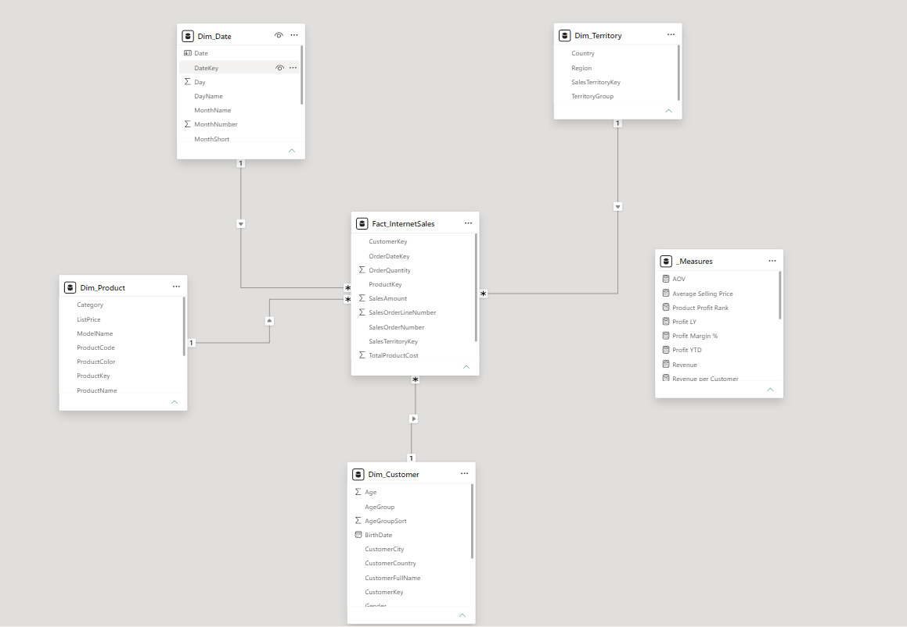
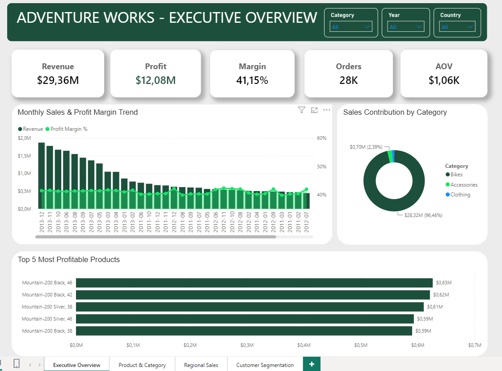
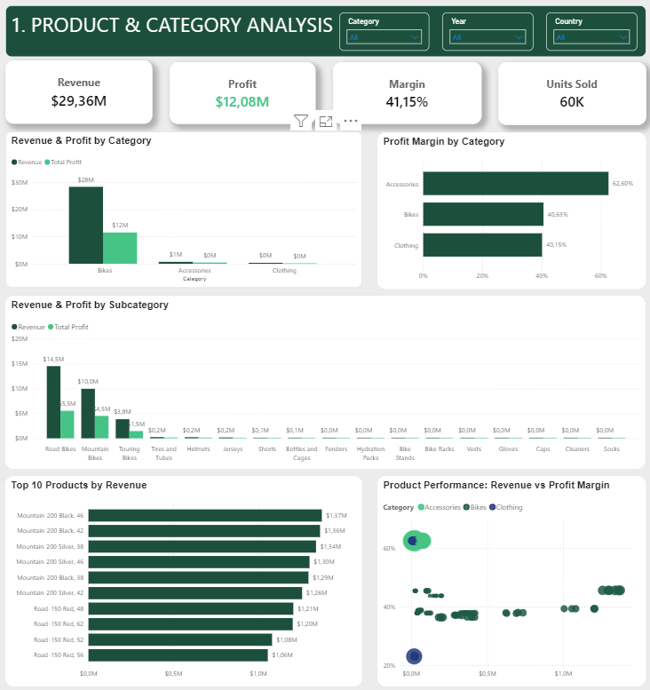
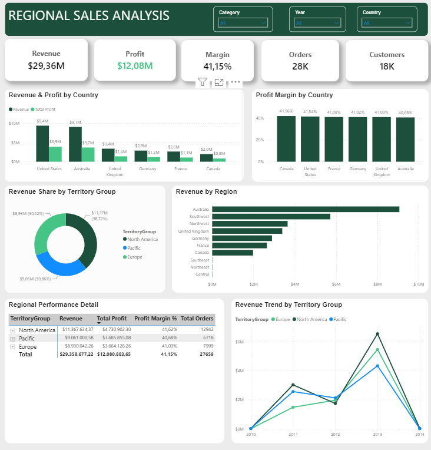
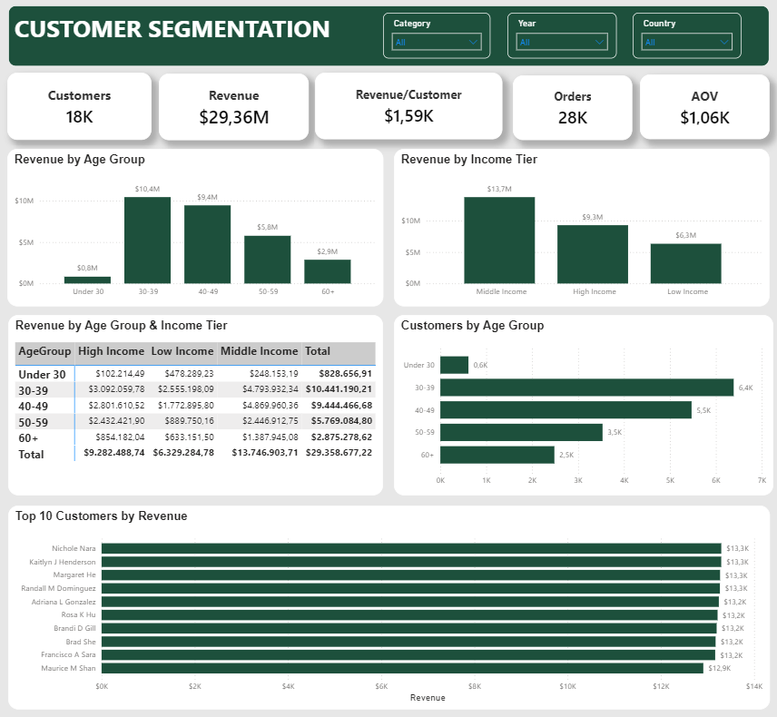

# AdventureWorks - Phân tích Doanh thu & Lợi nhuận

## Mục lục

1. [Tổng quan dự án](#1-tổng-quan-dự-án)
2. [Mục tiêu phân tích](#2-mục-tiêu-phân-tích)
3. [Dữ liệu](#3-dữ-liệu)
4. [Công cụ sử dụng](#4-công-cụ-sử-dụng)
5. [Tiền xử lý dữ liệu bằng SQL](#5-tiền-xử-lý-dữ-liệu-bằng-sql)
6. [Mô hình dữ liệu](#6-mô-hình-dữ-liệu)
7. [Các DAX Measures](#7-các-dax-measures)
8. [Dashboard](#8-dashboard)
9. [Insight chính](#9-insight-chính)
10. [Đề xuất kinh doanh](#10-đề-xuất-kinh-doanh)

---

## 1. Tổng quan dự án

Dự án sử dụng bộ dữ liệu **AdventureWorksDW2019** để phân tích hoạt động bán hàng của AdventureWorks trên các khía cạnh:

- Doanh thu và lợi nhuận
- Hiệu quả sản phẩm
- Hiệu quả theo khu vực
- Phân khúc khách hàng

Mục tiêu của dự án là xây dựng một quy trình Business Intelligence hoàn chỉnh, từ dữ liệu thô trong SQL Server đến dashboard Power BI phục vụ việc theo dõi và hỗ trợ ra quyết định kinh doanh.

Quy trình thực hiện:

**SQL Server → Data Preparation → Data Modeling → DAX → Power BI Dashboard → Business Insights**

---

## 2. Mục tiêu phân tích

Dự án tập trung trả lời 4 nhóm câu hỏi kinh doanh chính.

### 2.1. Tổng quan hoạt động kinh doanh

- Tổng doanh thu và lợi nhuận của doanh nghiệp là bao nhiêu?
- Biên lợi nhuận hiện tại như thế nào?
- Doanh thu thay đổi như thế nào theo thời gian?
- Những sản phẩm nào đóng góp nhiều lợi nhuận nhất?

### 2.2. Phân tích sản phẩm

- Category và Subcategory nào tạo ra nhiều doanh thu nhất?
- Nhóm sản phẩm nào có Profit Margin cao?
- Sản phẩm nào tạo ra nhiều Revenue và Profit nhất?

### 2.3. Phân tích khu vực

- Quốc gia nào đóng góp nhiều Revenue và Profit nhất?
- Profit Margin khác nhau như thế nào giữa các quốc gia?
- Revenue được phân bổ như thế nào giữa các Territory Group?
- Hiệu quả kinh doanh của các khu vực thay đổi như thế nào theo thời gian?

### 2.4. Phân tích khách hàng

- Nhóm tuổi nào tạo ra nhiều Revenue nhất?
- Nhóm thu nhập nào đóng góp nhiều Revenue nhất?
- Nhóm tuổi nào có số lượng khách hàng lớn nhất?
- Sự kết hợp giữa Age Group và Income Tier ảnh hưởng như thế nào đến Revenue?
- Những khách hàng nào tạo ra Revenue cao nhất?

---

## 3. Dữ liệu

Dự án sử dụng cơ sở dữ liệu:

**AdventureWorksDW2019**

Bảng giao dịch chính:

`FactInternetSales`

gồm:

**60,398 dòng dữ liệu bán hàng**

và:

**27,659 đơn hàng khác nhau.**

### Các bảng nguồn chính

| Bảng | Vai trò |
|---|---|
| `FactInternetSales` | Dữ liệu giao dịch bán hàng |
| `DimCustomer` | Thông tin khách hàng |
| `DimProduct` | Thông tin sản phẩm |
| `DimProductSubcategory` | Phân nhóm sản phẩm |
| `DimProductCategory` | Category sản phẩm |
| `DimSalesTerritory` | Khu vực bán hàng |
| `DimDate` | Thông tin thời gian |
| `DimGeography` | Thông tin địa lý khách hàng |

Sau quá trình xử lý, dữ liệu được tổ chức lại thành mô hình đơn giản hơn phục vụ phân tích trong Power BI.

---

## 4. Công cụ sử dụng

| Công cụ | Mục đích |
|---|---|
| SQL Server | Truy vấn dữ liệu |
| SQL | Làm sạch, JOIN và biến đổi dữ liệu |
| Power Query | Load dữ liệu và kiểm tra Data Type |
| DAX | Xây dựng KPI và Business Metrics |
| Power BI Desktop | Data Modeling và Visualization |
---

## 5. Tiền xử lý dữ liệu bằng SQL

SQL được sử dụng để chuyển dữ liệu từ AdventureWorksDW2019 thành các bảng phù hợp cho việc phân tích.

File SQL:

`Sql/data_preparation.sql`

### 5.1. Fact Internet Sales

Bảng Fact giữ các trường quan trọng:

- SalesOrderNumber
- SalesOrderLineNumber
- OrderDateKey
- CustomerKey
- ProductKey
- SalesTerritoryKey
- OrderQuantity
- UnitPrice
- TotalProductCost
- SalesAmount
---

### 5.2. Customer Dimension

`DimCustomer` được kết hợp với `DimGeography` để bổ sung thông tin khách hàng.

Các thuộc tính:

- Customer Full Name
- Gender
- Birth Date
- Age
- Age Group
- Yearly Income
- Income Tier
- Occupation
- City
- Country

Age Group được chia thành:

- Under 30
- 30-39
- 40-49
- 50-59
- 60+

Income Tier được chia thành:

- Low Income
- Middle Income
- High Income

---

### 5.3. Product Dimension

Thông tin sản phẩm được kết hợp từ:

`DimProduct`

→ `DimProductSubcategory`

→ `DimProductCategory`

Qua đó mỗi sản phẩm có thể được phân tích theo:

**Product → Subcategory → Category**

Các giá trị NULL ở một số thuộc tính phân loại được thay bằng `Unknown` và `Other`.

---

### 5.4. Date Dimension

`DimDate` cung cấp các thuộc tính thời gian:

- Date
- Day
- Day Name
- Month
- Month Number
- Quarter
- Year
- Year-Month

Bảng Date được sử dụng để thực hiện các phân tích Time Intelligence trong Power BI.

---

### 5.5. Territory Dimension

`DimSalesTerritory` cung cấp:

- Region
- Country
- Territory Group

Cho phép phân tích hiệu quả kinh doanh theo nhiều cấp địa lý.

---

## 6. Mô hình dữ liệu

Dữ liệu được tổ chức theo **Star Schema**.



`Fact_InternetSales` là bảng Fact trung tâm.

Các Dimension kết nối với Fact thông qua:

- `CustomerKey`
- `ProductKey`
- `OrderDateKey`
- `SalesTerritoryKey`

và:

## 7. Các DAX Measures

Project xây dựng nhiều DAX Measure phục vụ phân tích.

### KPI chính

```text
Revenue
Total Cost
Total Profit
Profit Margin %
Total Orders
Units Sold
Total Customers
AOV
Average Selling Price
Revenue per Customer
```

### Time Intelligence

```text
Sales LY
Profit LY
YoY Sales Growth %
YoY Profit Growth %
Revenue YTD
Profit YTD
```

### Product Analysis

```text
Revenue Share %
Product Profit Rank
Top 5 Product Flag
```

## 8. Dashboard

Dashboard gồm **4 trang phân tích chính**.

### 8.1. Executive Overview

Trang tổng quan giúp theo dõi nhanh:

- Revenue
- Profit
- Profit Margin
- Orders
- AOV
- Sales Trend
- Revenue Contribution by Category
- Top 5 Most Profitable Products



---

### 8.2. Product & Category Analysis

Trang này tập trung phân tích hiệu quả sản phẩm thông qua:

- Revenue & Profit by Category
- Profit Margin by Category
- Revenue & Profit by Subcategory
- Top 10 Products by Revenue
- Product Performance: Revenue vs Profit Margin



---

### 8.3. Regional Sales Analysis

Trang Regional Sales phân tích hiệu quả kinh doanh theo địa lý:

- Revenue & Profit by Country
- Profit Margin by Country
- Revenue Share by Territory Group
- Revenue by Region
- Revenue Trend by Territory Group
- Regional Performance Detail



---

### 8.4. Customer Segmentation

Trang Customer Segmentation tập trung vào hành vi và giá trị của các nhóm khách hàng:

- Revenue by Age Group
- Revenue by Income Tier
- Customers by Age Group
- Revenue by Age Group & Income Tier
- Top 10 Customers by Revenue



---

## 9. Insight chính

### 9.1. Doanh thu và lợi nhuận phụ thuộc gần như hoàn toàn vào Bikes

Bikes tạo ra khoảng **$28.32M Revenue**, tương đương **96.46% tổng Revenue**, và khoảng **$11.5M Profit**, tương đương gần 95% tổng Profit ($12.08M). Sự phụ thuộc này còn tập trung hơn ở cấp sản phẩm: cả 5 sản phẩm có lợi nhuận cao nhất đều là các biến thể của Mountain-200 (Black và Silver, các size 38 đến 46), và cộng lại tạo ra khoảng $3.04M, tức khoảng 26,43% tổng Profit của doanh nghiệp.

Ngược lại, doanh thu lại rất phân tán ở cấp khách hàng. Top 10 khách hàng lớn nhất chỉ đóng góp khoảng $132K, chưa tới 0.5% tổng Revenue nên tổng doanh thu không phụ thuộc hoàn toàn vào 10 khách này nên rủi ro về khách hàng thấp. Điều này cho thấy rủi ro của AdventureWorks nằm ở sản phẩm: ví nếu dòng Mountain-200 gặp sự cố về nguồn cung, lợi nhuận toàn công ty sẽ bị ảnh hưởng trực tiếp.

---

### 9.2. Accessories có biên lợi nhuận cao nhưng quy mô còn quá nhỏ

Accessories chỉ chiếm khoảng **2.39% tổng Revenue**, nhưng đạt **Profit Margin khoảng 62.60%**, cao hơn nhiều so với Bikes (khoảng 40.63%). Nói cách khác, mỗi $1 doanh thu từ Accessories giữ lại được khoảng $0.63 lợi nhuận, trong khi con số này ở Bikes chỉ là khoảng $0.41.

Tuy vậy, vì quy mô quá nhỏ (khoảng $0.70M Revenue), Accessories mới đóng góp khoảng $0.44M Profit, tức chưa tới 4% trên tổng $12,08M Profit. Biên lợi nhuận cao chưa đồng nghĩa với đóng góp lợi nhuận lớn. Accessories có biên lợi nhuận cao (62.60%) nhưng giá trị mỗi đơn hàng có Accessories chỉ khoảng $38.49, thấp hơn rất nhiều so với giá trị đơn hàng trung bình của toàn công ty ($1.06K). Vì vậy giá trị của nhóm này nằm ở dư địa tăng trưởng: bán kèm Accessories cho khách hàng đang mua xe là cơ hội tự nhiên để tăng lợi nhuận trên mỗi đơn hàng. Nếu giá trị mỗi đơn có Accessories tăng thêm $10, nhân cho 18,206 đơn hàng thì revenue tăng thêm $182,060, lợi nhuận tăng khoảng $113,970, Profit toàn công ty có thể tăng khoảng 0.9%.

---

### 9.3. Road Bikes dẫn đầu về Revenue, nhưng Mountain Bikes hiệu quả hơn về lợi nhuận

Trong nhóm Bikes, Road Bikes tạo ra nhiều doanh thu nhất với khoảng **$14.5M**, chiếm gần một nửa tổng Revenue. Mountain Bikes đứng thứ hai với khoảng $10.0M, và Touring Bikes khoảng $3.8M.

Tuy nhiên, thứ hạng theo Revenue không giống thứ hạng theo Profit. Road Bikes tạo ra khoảng $5.5M Profit, tương đương Profit Margin khoảng 38%, trong khi Mountain Bikes tạo ra khoảng $4.5M Profit trên doanh thu thấp hơn, tương đương Profit Margin khoảng 45%. Chênh lệch khoảng 7 điểm phần trăm này có nghĩa là mỗi $1M doanh thu chuyển từ Road Bikes sang Mountain Bikes sẽ mang thêm khoảng $70K lợi nhuận. Điều này cũng khớp với việc Top 5 sản phẩm lợi nhuận cao nhất đều thuộc Mountain-200, trong khi Road-150 xuất hiện bốn lần trong Top 10 Revenue nhưng không có mặt trong Top 5 Profit.

---

### 9.4. North America dẫn đầu về Revenue, nhưng khác biệt thực sự giữa các khu vực nằm ở giá trị đơn hàng

Theo Territory Group, North America tạo ra khoảng **$11.37M** (38.72%), Pacific khoảng **$9.06M** (30.86%) và Europe khoảng **$8.93M** (30.42%). Tuy nhiên, vị trí dẫn đầu của North America chủ yếu đến từ việc gộp hai quốc gia là United States (khoảng $9.4M) và Canada (khoảng $2.0M). Nếu so theo từng quốc gia, United States chỉ nhỉnh hơn Australia (khoảng $9.1M, gần như toàn bộ khu vực Pacific) khoảng 3%.

Điều đáng chú ý hơn là Profit Margin giữa các quốc gia gần như không khác nhau, dao động trong khoảng hẹp từ 40.68% (Australia) đến 41.96% (Canada). Sự khác biệt thực sự nằm ở giá trị đơn hàng. North America có nhiều đơn hàng nhất (12,942 đơn) nhưng giá trị trung bình mỗi đơn chỉ khoảng $878. Pacific chỉ có 6,718 đơn, nhưng AOV lên tới khoảng $1,349, cao hơn North America khoảng 54%. Europe nằm ở giữa với 7,999 đơn và AOV khoảng $1,116.

Về xu hướng theo thời gian, Europe là khu vực tăng nhanh nhất giai đoạn 2011 đến 2013, với Revenue tăng khoảng 3.6 lần và tỷ trọng trong tổng Revenue tăng từ khoảng 21% lên khoảng 33%, trong khi North America tăng khoảng 2.2 lần và Pacific khoảng 1.7 lần. Vì biên lợi nhuận gần như bằng nhau, việc tăng lợi nhuận theo khu vực phụ thuộc chủ yếu vào việc tăng số lượng đơn hàng và giá trị mỗi đơn, chứ không phải tối ưu margin.

---

### 9.5. Nhóm 30-39 đông nhất, nhưng nhóm 40-49 có giá trị cao hơn trên mỗi khách hàng

Nhóm tuổi **30-39** tạo ra khoảng **$10.4M Revenue** và có số lượng khách hàng lớn nhất, khoảng **6.4K**. Nhóm 40-49 đứng thứ hai với khoảng $9.4M Revenue và 5.5K khách hàng. Hai nhóm này cộng lại tạo ra khoảng 68% tổng Revenue, cho thấy tệp khách hàng cốt lõi của AdventureWorks nằm trong độ tuổi từ 30 đến 49.

Tuy nhiên, khi chia Revenue cho số khách hàng, nhóm 40-49 chi tiêu trung bình khoảng $1.72K mỗi người, cao hơn nhóm 30-39 (khoảng $1.63K). Như vậy 30-39 dẫn đầu nhờ số lượng, còn 40-49 có giá trị cao hơn trên mỗi khách hàng. Ở hai đầu còn lại, nhóm Under 30 chỉ đóng góp khoảng 2.8% Revenue, còn nhóm 60+ có mức chi tiêu thấp nhất, khoảng $1.15K mỗi khách hàng.

---

### 9.6. Middle Income đóng góp nhiều nhất, nhưng cơ cấu thu nhập khác nhau giữa các độ tuổi

Theo Income Tier, Middle Income tạo ra khoảng **$13.7M** (khoảng 47% tổng Revenue), High Income khoảng **$9.3M** (khoảng 32%) và Low Income khoảng **$6.3M** (khoảng 22%).

Cơ cấu thu nhập cũng khác nhau rõ rệt giữa các độ tuổi. Nhóm 30-39 đóng góp khoảng 40% toàn bộ Revenue của nhóm Low Income ($2.56M trên $6.33M), cho thấy đây là nhóm khách hàng đông nhưng không đồng đều về khả năng chi tiêu. Nhóm Under 30 có khoảng 58% Revenue đến từ Low Income, và quy mô tổng thể còn rất nhỏ.

---

### 9.7. Phân khúc cốt lõi là nhóm 30-49 tuổi có thu nhập trung bình

Khi kết hợp Age Group và Income Tier, hai phân khúc lớn nhất gần như ngang nhau: **40-49 + Middle Income** tạo ra khoảng **$4.87M Revenue** và **30-39 + Middle Income** tạo ra khoảng **$4.79M Revenue**, mỗi nhóm chiếm khoảng 16% tổng Revenue. Với nhóm High Income, phân khúc lớn nhất là **30-39 + High Income** với khoảng $3.09M, cho thấy đây là tệp khách hàng phù hợp để giới thiệu các sản phẩm cao cấp.

---

## 10. Đề xuất kinh doanh

### Bán kèm Accessories với Bikes

Bikes tạo ra phần lớn Revenue trong khi Accessories có Profit Margin cao nhưng mới chiếm tỷ trọng rất nhỏ. Doanh nghiệp có thể tăng lợi nhuận trên mỗi đơn hàng bằng cách bán kèm Accessories ngay tại thời điểm khách hàng mua xe, ví dụ Bike kèm Bottles and Cages hoặc Bike kèm Hydration Pack. Các chỉ số nên theo dõi là tỷ lệ đơn hàng Bikes có kèm Accessories (Attach Rate), doanh thu Accessories trên mỗi đơn và Profit per Order.

### Thử nghiệm Bundle sản phẩm

Thay vì áp dụng ngay trên toàn thị trường, nên thử nghiệm các gói bundle ở một khu vực trước, ví dụ United States, rồi so sánh AOV và Profit per Order giữa nhóm có bundle và nhóm không có. Cách làm này vừa kiểm chứng được hiệu quả, vừa giải quyết vấn đề AOV của North America đang thấp hơn đáng kể so với Pacific và Europe.

### Quản trị rủi ro phụ thuộc vào Mountain-200 và rà soát Road-150

Vì 5 biến thể Mountain-200 tạo ra khoảng 25% tổng Profit, doanh nghiệp nên theo dõi riêng nhóm này về tồn kho, giá bán và biên lợi nhuận theo tháng. 

### Tập trung vào nhóm khách hàng 30-49 tuổi

Hai nhóm 30-39 và 40-49 tạo ra khoảng 68% Revenue. Doanh nghiệp nên ưu tiên các chương trình giữ chân khách hàng và ưu đãi cá nhân hóa cho nhóm này, đặc biệt là phân khúc Middle Income. Với nhóm 30-39 có thu nhập cao, có thể giới thiệu các dòng sản phẩm cao cấp và phụ kiện. Nhóm Under 30 hiện đóng góp nhỏ và thiên về thu nhập thấp, nên chưa cần dồn nhiều ngân sách cho đến khi có thêm bằng chứng về giá trị lâu dài của nhóm này. Các chỉ số nên theo dõi là Revenue per Customer, số đơn hàng trên mỗi khách hàng và tỷ lệ khách hàng quay lại mua.

### Tối ưu chiến lược theo khu vực

Không nên đánh giá thị trường chỉ dựa trên Revenue. Vì Profit Margin giữa các quốc gia gần như bằng nhau, cần kết hợp Revenue, số lượng đơn hàng và AOV để xác định ưu tiên: tăng giá trị mỗi đơn tại United States, giữ chân nhóm khách có giá trị đơn cao tại Australia và đầu tư tăng trưởng tại Europe, nơi có tốc độ tăng nhanh nhất.

---

## Kết luận

Dự án xây dựng một quy trình BI hoàn chỉnh từ việc truy vấn và xử lý dữ liệu bằng SQL, thiết kế Star Schema, xây dựng DAX Measure đến trực quan hóa dữ liệu bằng Power BI.

Dashboard cho phép phân tích hoạt động kinh doanh từ nhiều góc nhìn khác nhau, bao gồm:

**Executive Performance → Product → Region → Customer**

Qua đó, dự án không chỉ tập trung vào việc trực quan hóa dữ liệu mà còn sử dụng dữ liệu để xác định các cơ hội cải thiện doanh thu và lợi nhuận.
